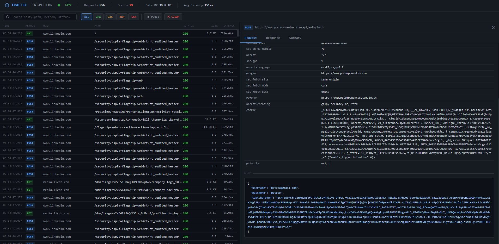

# Traffic Inspector

A self-hosted HTTPS inspection proxy for cybersecurity analysis.
Traffic Inspector intercepts TLS traffic using SSL offloading, decrypts it with a custom root CA you install once, and streams every request and response to a real-time analyst dashboard.



---

## How it works

```
Browser ──(HTTPS)──► Traffic Inspector :8080
                          │
                     mitmproxy engine
                     generates per-domain
                     certificate on-the-fly
                          │
                    ┌─────┴──────┐
                    │            │
               Logs flow    Re-encrypts
               to dashboard  forwards to
               via WebSocket  real server
```

When a browser is configured to use `127.0.0.1:8080` as its HTTP/HTTPS proxy, Traffic Inspector performs a **TLS man-in-the-middle** for every HTTPS connection:

1. The browser sends a `CONNECT` request for the target hostname
2. mitmproxy generates a certificate for that hostname, signed by your root CA
3. The browser accepts it (because the root CA is trusted)
4. mitmproxy makes its own TLS connection to the real server
5. All plaintext request/response data is logged and displayed in the dashboard

---

## Requirements

- Docker and Docker Compose
- `openssl` (for CA generation in `setup.sh`)
- A modern browser

---

## Quick start

### 1. Generate the CA and build the image

```bash
git clone <repo>
cd traffic-inspector
chmod +x setup.sh
./setup.sh
```

This creates `certs/ca.crt` (the root CA certificate) and builds the Docker image.

---

### 2. Install the CA certificate

The browser must trust the root CA or it will show certificate errors for every HTTPS site.

**Linux (Debian / Ubuntu)**
```bash
sudo cp certs/ca.crt /usr/local/share/ca-certificates/traffic-inspector.crt
sudo update-ca-certificates
```

**Linux (RHEL / Fedora / CentOS)**
```bash
sudo cp certs/ca.crt /etc/pki/ca-trust/source/anchors/traffic-inspector.crt
sudo update-ca-trust extract
```

**macOS**
```bash
sudo security add-trusted-cert -d -r trustRoot \
  -k /Library/Keychains/System.keychain certs/ca.crt
```

**Windows (PowerShell as Administrator)**
```powershell
certutil -addstore -f "ROOT" certs\ca.crt
```

**Firefox (any OS — manual)**
Settings → Privacy & Security → Certificates → View Certificates →
Authorities → Import → select `certs/ca.crt` → Trust for websites ✓

---

### 3. Start the stack

```bash
docker compose up
```

| Service | Port | Purpose |
|---|---|---|
| mitmproxy | `8080` | HTTP/HTTPS interception proxy |
| nginx → dashboard | `80` | Analyst web interface |

---

### 4. Configure your browser proxy

Set both HTTP and HTTPS proxy to:

```
Host:  127.0.0.1
Port:  8080
```

Most browsers expose this under *Settings → Network → Proxy* (or use a browser extension like FoxyProxy for per-profile control).

---

### 5. Open the dashboard

```
http://localhost
```

Browse normally. Every request and response appears in the dashboard in real time.

---

## Dashboard


### Traffic table

Each row represents one complete HTTP/HTTPS transaction:

| Column | Description |
|---|---|
| Time | Timestamp with millisecond precision |
| Method | HTTP verb — color-coded badge |
| Host | Target hostname |
| Path | Request path (truncated, full URL in tooltip) |
| Status | HTTP status code — color-coded by class |
| Size | Response body size |
| Latency | Round-trip time from request to response |

**Color coding**

| Color | Meaning |
|---|---|
| Green | `2xx` Success |
| Yellow | `3xx` Redirect |
| Orange | `4xx` Client error |
| Red | `5xx` Server error / connection error |

### Detail panel

Click any row to open the detail panel on the right. It has three tabs:

**Request**
- Full request line (method, URL, HTTP version)
- All request headers in a searchable table
- Decoded request body (JSON is syntax-highlighted)

**Response**
- Status line with reason phrase
- All response headers
- Decoded response body (JSON is syntax-highlighted, binary data shows size)

**Summary**
- At-a-glance metadata: URL, method, status, host, scheme, content-type, response size, latency, timestamp, and internal entry ID

### Controls

| Control | Action |
|---|---|
| Search box | Filter by host, path, method, status code, or content-type |
| `All` `2xx` `3xx` `4xx` `5xx` | Filter by status class |
| ⏸ Pause | Stop adding new entries without losing data |
| ✕ Clear | Clear all entries from dashboard and server buffer |
| Drag divider | Resize the detail panel |

**Keyboard shortcuts**

| Key | Action |
|---|---|
| `/` | Focus the search box |
| `Esc` | Close the detail panel |
| `Ctrl+Space` | Toggle pause |

---

## Project structure

```
traffic-inspector/
├── setup.sh            # CA generation + Docker build
├── docker-compose.yml  # Service definition
├── Dockerfile          # Python 3.11-slim + nginx
├── start.sh            # Container entrypoint
├── nginx.conf          # Reverse proxy config (port 80 → 5000)
├── requirements.txt    # mitmproxy, aiohttp
├── addon.py            # mitmproxy addon + embedded aiohttp server
├── certs/              # Generated by setup.sh (not committed)
│   ├── ca.key          # Root CA private key
│   ├── ca.crt          # Root CA certificate  ← install this
│   └── mitmproxy-ca.pem
└── static/
    └── index.html      # Dashboard UI (real-time WebSocket)
```

---

## Architecture detail

```
┌─────────────────────────────────────────────────────┐
│                   Docker container                   │
│                                                     │
│  ┌──────────────┐      ┌──────────────────────────┐ │
│  │   mitmproxy  │      │      aiohttp :5000        │ │
│  │   :8080      │─────►│  GET  /                   │ │
│  │              │ WS   │  GET  /api/entries        │ │
│  │  addon.py    │ push │  GET  /api/entry/{id}     │ │
│  │  intercepts  │      │  WS   /ws  (live feed)   │ │
│  │  all flows   │      └──────────────────────────┘ │
│  └──────────────┘                  ▲                 │
│                                    │                 │
│                            ┌───────────────┐        │
│                            │  nginx :80    │        │
│                            │  reverse proxy│        │
│                            └───────────────┘        │
└─────────────────────────────────────────────────────┘
         ▲                          ▲
         │ proxy traffic            │ dashboard
    Browser :8080             Browser :80
```

- **mitmproxy** handles the TLS interception and per-domain certificate generation. The root CA (`certs/ca.crt`) is used to sign all generated leaf certificates.
- **addon.py** is a mitmproxy addon that runs inside mitmproxy's asyncio event loop. It also starts an `aiohttp` web server on port 5000 that serves the dashboard and broadcasts live traffic events over WebSocket.
- **nginx** sits in front of the dashboard on port 80, handling HTTP keepalive and WebSocket upgrade headers.

---

## Security considerations

- This tool performs a TLS man-in-the-middle. Only use it on traffic you are authorized to inspect.
- The root CA private key (`certs/ca.key`) grants the ability to impersonate any HTTPS site to any machine that trusts the CA. Keep it local and do not commit it.
- Remove the CA from your system trust store when you are done to restore normal TLS behavior.
- The proxy is bound to `0.0.0.0:8080` inside the container; Docker maps it to `127.0.0.1:8080` on the host by default, so it is not exposed to the network.

---

## Stopping

```bash
docker compose down
```

To also remove the CA from your system trust store, reverse the install step for your OS (e.g. `sudo security remove-trusted-cert -d certs/ca.crt` on macOS).
